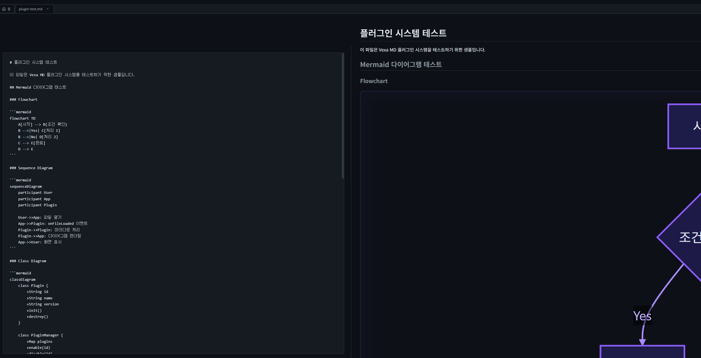

# Mermaid 다이어그램 크기 및 분할 화면 레이아웃 문제

## 날짜
2026-01-25

## 증상

### 1. Mermaid 다이어그램 크기 문제
- Flowchart, Class Diagram, State Diagram이 원본 크기보다 3~4배 크게 렌더링됨
- Sequence Diagram만 정상 크기로 표시
- 예: Flowchart 원본 271x469px → 렌더링 800x1386px

### 2. 분할 화면 레이아웃 문제
- Split 모드에서 뷰어(오른쪽) 영역이 50%가 아닌 전체 너비(100%)를 차지
- 다이어그램이 오른쪽 끝으로 밀려서 잘림
- 에디터와 뷰어가 겹침



## 원인 분석

### 1. Mermaid 다이어그램 크기 문제

**CSS 설정 오류**:
```css
/* 문제 코드 - plugin-ui.css */
.mermaid-diagram svg {
  width: 100%;
  max-width: 800px;  /* 모든 SVG를 800px까지 확대 */
}
```

SVG의 `width: 100%`와 `max-width: 800px` 설정으로 인해:
- 원본이 작은 다이어그램(271px)이 800px까지 확대됨
- 비율 유지로 높이도 함께 확대 (469 * 800/271 = 1386px)

**디버깅 로그 분석**:
```
Flowchart BEFORE: viewBox="0 0 270.90625 469.265625"
Flowchart AFTER: width=800, height=1385.75  ← 문제!

Sequence BEFORE: viewBox="-50 -10 651 467"
Sequence AFTER: width=800, height=573.875  ← 원본과 비슷해서 정상으로 보임
```

### 2. 분할 화면 레이아웃 문제

**CSS 충돌**:

`toc.css` (라인 146-151):
```css
#main-container #content {
  position: relative;  /* absolute가 아닌 relative */
  flex: 1;             /* flex 자식으로 설정 */
}
```

`editor.css` (라인 97-101):
```css
#main-container.mode-split #content {
  left: 50%;
  right: 0;
  /* position 미지정 - relative가 유지됨 */
}
```

**문제점**:
- `toc.css`에서 `position: relative`로 설정
- `editor.css`에서 `position`을 덮어쓰지 않음
- `left: 50%`가 절대 위치가 아닌 상대 이동으로 작동
- 결과: 요소가 50% 이동하지만 너비는 그대로 유지

## 해결 방법

### 1. Mermaid 다이어그램 크기 수정

**src/plugins/mermaid/index.js** - 원본 크기를 max-width로 설정:
```javascript
// SVG 원본 크기 추출
const viewBox = svgEl.getAttribute('viewBox');
const parts = viewBox.split(/\s+/);
const originalWidth = parseFloat(parts[2]);
const originalHeight = parseFloat(parts[3]);

// 원본 크기를 최대값으로 설정 (확대 방지, 축소만 허용)
svgEl.setAttribute('width', '100%');
svgEl.setAttribute('height', 'auto');
svgEl.style.maxWidth = `${originalWidth}px`;
svgEl.style.maxHeight = `${originalHeight}px`;
```

**src/modules/plugins/plugin-ui.css** - 고정 max-width 제거:
```css
/* 수정 전 */
.mermaid-diagram svg {
  width: 100%;
  max-width: 800px;
}

/* 수정 후 */
.mermaid-diagram svg {
  display: block;
  margin: 0 auto;
  /* max-width는 JS에서 원본 크기 기준으로 설정 */
}
```

### 2. 분할 화면 레이아웃 수정

**src/modules/editor/editor.css** - position 명시적 설정:
```css
/* 수정 전 */
#main-container.mode-split #content {
  left: 50%;
  right: 0;
  padding: 24px 32px;
}

/* 수정 후 */
#main-container.mode-split #content {
  position: absolute;  /* 명시적으로 absolute 설정 */
  top: 0;
  left: 50%;
  right: 0;
  bottom: 0;
  padding: 24px 32px;
  flex: none;          /* flex 레이아웃 비활성화 */
}
```

## 관련 파일

- `src/plugins/mermaid/index.js` - Mermaid 플러그인
- `src/modules/plugins/plugin-ui.css` - 플러그인 스타일
- `src/modules/editor/editor.css` - 에디터/분할 모드 레이아웃
- `src/modules/toc/toc.css` - TOC 레이아웃 (충돌 원인)

## 테스트 방법

1. Mermaid 다이어그램이 포함된 마크다운 파일 열기
2. View 모드에서 다이어그램 크기 확인 (원본 크기 유지)
3. Split 모드로 전환
4. 에디터(왼쪽 50%)와 뷰어(오른쪽 50%) 영역 확인
5. 다이어그램이 뷰어 영역 내에서 잘리지 않고 표시되는지 확인

## 교훈

1. **CSS 선택자 특이성 주의**: 동일 요소에 여러 CSS 파일에서 스타일 적용 시 충돌 가능
2. **position 속성 명시**: 레이아웃 모드별로 position 속성을 명시적으로 설정
3. **SVG 반응형 처리**: `width: 100%` + `max-width: [고정값]`은 원본보다 확대될 수 있음
4. **디버깅 로그 활용**: DOM 삽입 전후 크기 비교로 문제 원인 파악

## 참고

- Mermaid.js 공식 문서: https://mermaid.js.org
- CSS Flexbox vs Position: flexbox 자식에 `position: absolute` 적용 시 동작
